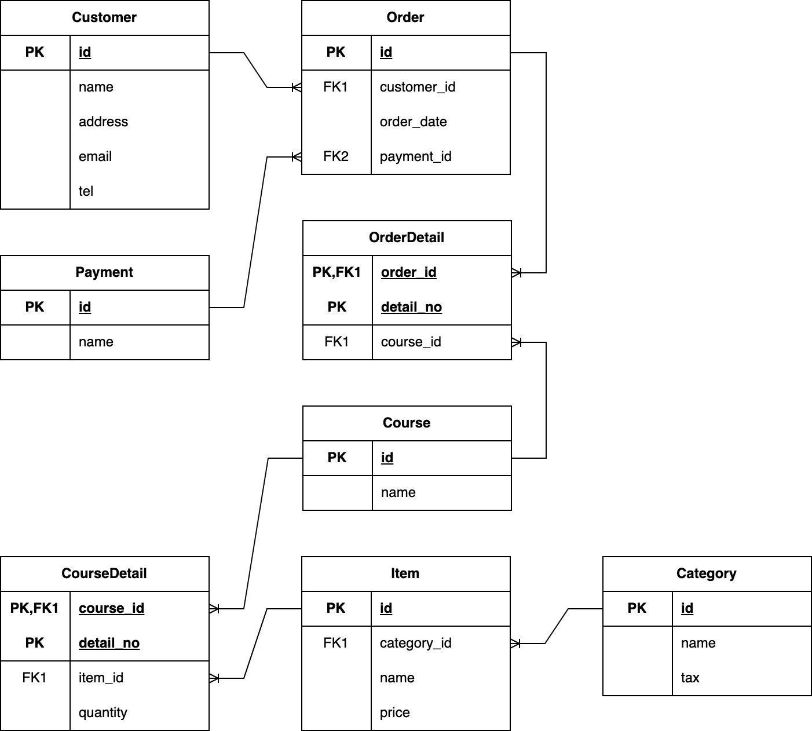
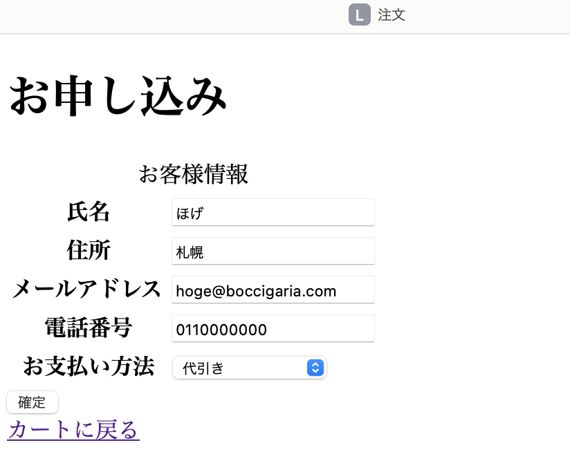

# はじめてのSpring Framework
## はじめに
こちらのプロジェクトはSpring Frameworkを使用した、なんちゃってECサイトです。
Spring Frameworkを初めて触ることになったため、基本的な機能を試すために作成しました。
## 使用技術
- Java SE 21
- Spring Boot 3.2.4
- maven 4.0.0
- MySQL for mac 8.3.0
- Thymeleaf 3.1.1
その他Javaで使用するライブラリは[pom.xml](./pom.xml)を参照してください。
## プロジェクト構成
```bash
.
├── pom.xml
└── src
    ├── main
    │   ├── java
    │   │   └── com
    │   │       └── boccigaria
    │   │           └── testecsite
    │   │               ├── DemoApplication.java
    │   │               ├── config
    │   │               │   └── MvcConfig.java
    │   │               ├── controller
    │   │               │   ├── CartController.java
    │   │               │   ├── CatalogController.java
    │   │               │   ├── OrderController.java
    │   │               │   ├── TestController.java
    │   │               │   └── UserController.java
    │   │               ├── repository
    │   │               │   ├── CategoryRepository.java
    │   │               │   ├── CourseRepository.java
    │   │               │   ├── CustomerRepository.java
    │   │               │   ├── ItemRepository.java
    │   │               │   ├── OrderDetailRepository.java
    │   │               │   ├── OrderRepository.java
    │   │               │   ├── PaymentRepository.java
    │   │               │   ├── UserRepository.java
    │   │               │   └── entity
    │   │               │       ├── Category.java
    │   │               │       ├── Course.java
    │   │               │       ├── CourseDetail.java
    │   │               │       ├── Customer.java
    │   │               │       ├── Item.java
    │   │               │       ├── Order.java
    │   │               │       ├── OrderDetail.java
    │   │               │       ├── Payment.java
    │   │               │       ├── User.java
    │   │               │       └── key
    │   │               │           ├── CourseDetailPKey.java
    │   │               │           └── OrderDetailPKey.java
    │   │               └── service
    │   │                   └── OrderPlacementService.java
    │   └── resources
    │       ├── application.properties
    │       ├── static
    │       └── templates
    │           ├── cart
    │           │   └── index.html
    │           ├── catalog
    │           │   ├── detail.html
    │           │   └── index.html
    │           ├── home.html
    │           ├── login.html
    │           ├── order
    │           │   ├── complete.html
    │           │   └── form.html
    │           └── user
    │               ├── add
    │               │   ├── complete.html
    │               │   └── form.html
    │               ├── edit
    │               │   ├── complete.html
    │               │   └── form.html
    │               └── list.html
    └── test
        └── java
            └── com
                └── boccigaria
                    └── testecsite
                        ├── DemoApplicationTests.java
                        ├── ShoppingCartControllerIT.java
                        └── ShoppingCartControllerTest.java
```
テストクラスは時間の都合上ほとんど作成できていませんが、優しい目で見ていただけると幸いです。

## データ設計
今回のECサイトを構成するエンティティはこちら



## 機能をざっくり紹介
はじまりはカタログページ<br>
あらかじめデータベースに登録しておいたコースを一覧で表示しています。<br>


<br>
コースの中身は「詳細」で確認可能<br>


<br>
「カートに追加」ではセッションに選択したコースを保持します。<br>


<br>
とりあえず他にも追加して、「カートを見る」で買い物かごを確認<br>


<br>
「カートを空にする」で買い物かごの中身をリセットできます。<br>


<br>
あらためて買い物かごに商品を入れて、「注文する」で注文フォームへ進みます。<br>



<br>
注文フォームに必要事項を入力して、「確定」で注文が完了します。<br>


<br><br>
データベースに登録された結果がこちら<br>

注文ヘッダー


注文詳細


注文情報それぞれ結合


## おわりに
本家チュートリアルを読むところから始めて、ここまでの作業時間はおおよそ30時間ほどです。<br><br>
今回は主に
- Spring Web MVCのおおまかな処理の流れやデータの受け渡し
- Thymeleafでのテンプレートで動的なページを作成するための基本的なSpringELの文法
- Spring Data JPAを使用したデータベースの操作
- Spring Sessionを使用したインメモリセッションの実装

などを試してみました。<br>
<br>
セキュリティ保護やテストコードの作成、RESTful APIなど、商用レベルのアプリケーションを構築するには<br>
まだまだ学ぶべきことが山ほどありますが、地道にできることを増やしていこうと思います。<br>
